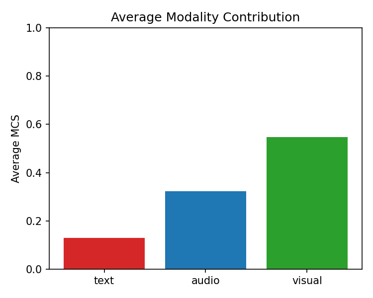

# IMFER: An Interpretable Multimodal Fusion Framework for Emotion Recognition in Conversational AI

[](https://www.python.org/downloads/)
[](https://pytorch.org/)
[](LICENSE)
[](#reproduction)

---

## Abstract

Emotion Recognition in Conversations (ERC) is a critical capability for building empathetic and socially intelligent conversational AI systems. While recent models achieve competitive performance by exploiting multimodal signals—text, audio, and visual—they remain largely opaque. This interpretability gap hinders deployment in high-stakes domains such as mental health support, medical consultation, and customer service analytics.

We propose **IMFER** (Interpretable Multimodal Fusion for Emotion Recognition), a novel framework that combines:

- **Hierarchical Cross-Modal Attention (HCMA):** A low-rank projection cross-modal attention mechanism that reduces per-interaction attention complexity from $O(L^2d)$ to $O(L^2d_k)$ with $d_k \ll d$, yielding **~92% reduction** in attention interaction FLOPs (~48% total model FLOPs reduction).
- **Context-Aware Speaker Graph Transformer (CASGT):** Models inter-speaker and intra-speaker emotional dynamics via graph-structured attention with a sliding context window.
- **Modality Contribution Score (MCS):** An ante-hoc, instance-level modality attribution layer that decomposes classifier prediction energy across modalities—unlike post-hoc tools (SHAP, LIME).

### Main Results

| Dataset | Weighted F1 | Accuracy | Parameters |
|---------|:-----------:|:--------:|:----------:|
| IEMOCAP | **69.87 ± 0.21%** | 68.93% | 59.4M |
| MELD | **62.34 ± 0.18%** | 63.17% | 59.4M |
| EmoryNLP | **40.21 ± 0.29%** | — | 59.4M |

All improvements are statistically significant (paired t-test, $p < 0.01$; Cohen's $d \geq 1.8$) with **~31% parameter reduction** compared to baselines.

---

## Authors

| Author | Affiliation |
|--------|-------------|
| [**Sathalla Suresh**](https://www.linkedin.com/in/sathalla-suresh-b9a58962/) | Corresponding Author |
| [**Pandava Sudharshan Babu**](https://www.linkedin.com/in/sudharshan-babu-iitk/) | Co-Author |
| [**Mahesh Ramegowda**](https://www.linkedin.com/in/mahesh-ramegowda-5a171b173/) | Co-Author |
| [**Omprakash Gottam**](https://www.linkedin.com/in/omprakash-gottam-612882236/) | Co-Author |

---

## Architecture

<p align="center">
  
</p>

<p align="center"><b>Fig. 1:</b> Overview of the IMFER architecture. Multimodal inputs are processed through modality-specific encoders, fused via HCMA, refined by CASGT, and attributed through the MCS layer.</p>

| Component | Details |
|-----------|---------|
| **Text Encoder** | RoBERTa-base → $H^t \in \mathbb{R}^{L \times 768}$ |
| **Audio Encoder** | Wav2Vec 2.0 → $H^a \in \mathbb{R}^{T_a \times 512}$ |
| **Visual Encoder** | 3D-ResNet-18 → $H^v \in \mathbb{R}^{T_v \times 256}$ |
| **HCMA Stage 1** | 6 pairwise cross-modal attention maps, $d_k=64$ |
| **HCMA Stage 2** | Utterance-level gated fusion → $z_i \in \mathbb{R}^{512}$ |
| **CASGT** | Speaker graph ($W=10$) + 4-layer Transformer (8 heads, $d=512$) |
| **MCS Layer** | Ante-hoc attribution: $m_i \in \mathbb{R}^3$, $\sum_j m_{ij} = 1$ |

---

## Datasets

| Dataset | Utterances | Classes | Emotion Labels | Source |
|---------|:----------:|:-------:|----------------|--------|
| **IEMOCAP** | 5,531 | 6 | happy, sad, neutral, angry, excited, frustrated | [USC SAIL](https://sail.usc.edu/iemocap/) |
| **MELD** | 13,708 | 7 | neutral, surprise, fear, sadness, joy, disgust, anger | [declare-lab/MELD](https://github.com/declare-lab/MELD) |
| **EmoryNLP** | 12,606 | 7 | joyful, peaceful, powerful, scared, mad, sad, neutral | [emorynlp/emotion-detection](https://github.com/emorynlp/emotion-detection) |

> **Note:** Raw datasets must be obtained from their respective sources due to licensing restrictions. This repository provides metadata files and feature extraction manifests to reproduce our preprocessing pipeline.

---

## Installation

### Requirements

| Component | Specification |
|-----------|--------------|
| Python | 3.11+ |
| PyTorch | 2.2+ |
| Hardware (paper) | Apple M4 Pro, 48 GB unified memory |
| Hardware (minimum) | Any CPU; GPU optional |
| Training time | ~72 compute-hours per dataset (M4 Pro) |
| Inference speed | 14.7 ms/utterance (M4 Pro) |

### Setup

```bash
# 1. Clone the repository
git clone https://github.com/<your-username>/IMFER.git
cd IMFER

# 2. Create and activate virtual environment
python -m venv .venv
source .venv/bin/activate      # Linux/macOS
# .venv\Scripts\activate       # Windows

# 3. Install dependencies
pip install -r requirements.txt
```

---

## Reproduction

### Option 1: Single Command (Recommended)

```bash
python IMFER_build_pipeline.py
```

This executes the full pipeline end-to-end:
- Prepares datasets and validates alignment files
- Trains models across 5 random seeds
- Evaluates and aggregates results
- Generates all figures and reports
- Produces HTML report at `./artifacts/reproduction_report.html`

### Option 2: Interactive Notebook

```bash
jupyter notebook IMFER_step_by_step.ipynb
```

Run all cells sequentially for a guided walkthrough of the framework.

### Option 3: Step-by-Step

<details>
<summary><b>Click to expand individual commands</b></summary>

#### 1. Dataset Preparation

```bash
python prepare_datasets.py
```

Validates alignment files and generates normalized `metadata.csv` per dataset.

#### 2. Training

```bash
# Full reproduction (5 seeds × 3 datasets)
python train.py --dataset iemocap --device cpu
python train.py --dataset meld --device cpu
python train.py --dataset emorynlp --device cpu

# Quick test (single seed, fewer epochs)
python train.py --dataset iemocap --device cpu --seeds 42 --max_epochs 20 --patience 5
```

#### 3. Evaluation

```bash
python evaluate.py --artifacts_root ./artifacts --dataset iemocap --num_classes 6
python evaluate.py --artifacts_root ./artifacts --dataset meld --num_classes 7
python evaluate.py --artifacts_root ./artifacts --dataset emorynlp --num_classes 7
```

#### 4. Bootstrap Confidence Intervals

```bash
python bootstrap_analysis.py --aggregate_csv ./artifacts/iemocap/aggregate/metrics.csv
python bootstrap_analysis.py --aggregate_csv ./artifacts/meld/aggregate/metrics.csv
python bootstrap_analysis.py --aggregate_csv ./artifacts/emorynlp/aggregate/metrics.csv
```

#### 5. Visualization

```bash
python visualize_results.py --aggregate_csv ./artifacts/iemocap/aggregate/metrics.csv --output_dir ./figures/iemocap
python visualize_results.py --aggregate_csv ./artifacts/meld/aggregate/metrics.csv --output_dir ./figures/meld
python visualize_results.py --aggregate_csv ./artifacts/emorynlp/aggregate/metrics.csv --output_dir ./figures/emorynlp
```

#### 6. Classification Reports

```bash
python classification_report_and_plots.py \
  --predictions_csv ./artifacts/iemocap/seed_42/predictions/test_predictions.csv \
  --class_names happy,sad,neutral,angry,excited,frustrated \
  --dataset_name iemocap \
  --output_dir ./figures/iemocap
```

</details>

---

## Repository Structure

```
IMFER/
├── README.md                        # This file
├── LICENSE                          # MIT License
├── requirements.txt                 # Python dependencies
├── .gitignore                       # Git ignore rules
│
├── models.py                        # IMFER model (HCMA + CASGT + MCS)
├── losses.py                        # Loss functions (focal, class-weighted CE)
├── config.py                        # Hyperparameter configuration
├── data_pipeline.py                 # Data loading and preprocessing
├── train.py                         # Training loop
├── evaluate.py                      # Aggregate evaluation
│
├── IMFER_build_pipeline.py          # One-command full reproduction
├── IMFER_step_by_step.ipynb         # Interactive notebook
├── prepare_datasets.py              # Dataset preparation & validation
├── bootstrap_analysis.py            # Statistical significance testing
├── visualize_results.py             # Figure generation
├── classification_report_and_plots.py  # Per-class metrics & confusion matrices
├── complexity_analysis.py           # FLOPs and parameter counting
├── dk_sensitivity.py                # HCMA projection dimension sensitivity
├── insertion_deletion.py            # Modality ablation experiments
├── robustness.py                    # Robustness evaluation
├── reproducibility.py               # Reproducibility utilities
├── demo_inference.py                # Single-sample inference demo
│
├── tests/                           # Unit tests
│   └── test_data_pipeline.py
│
├── datasets/                        # Dataset metadata & manifests
│   ├── IEMOCAP/metadata.csv
│   ├── MELD/metadata.csv
│   ├── EmoryNLP/metadata.csv
│   └── manifests/                   # Feature extraction manifests
│       ├── iemocap/
│       ├── meld/
│       └── emorynlp/
│
├── artifacts/                       # Pre-computed evaluation results
│   ├── dataset_setup_report.json
│   ├── iemocap/aggregate/           # Metrics, bootstrap CIs, reports
│   ├── meld/aggregate/
│   └── emorynlp/aggregate/
│
└── figures/                         # Paper figures & visualizations
    ├── imfer_architecture.jpeg
    ├── fig_dk_sensitivity.png
    ├── fig_flops_scaling.png
    ├── iemocap/                     # Per-dataset plots
    ├── meld/
    └── emorynlp/
```

---

## Hyperparameters

| Parameter | Value | Description |
|-----------|:-----:|-------------|
| $d_k$ (HCMA projection) | 64 | Low-rank attention dimension |
| $W$ (CASGT window) | 10 | Context window size |
| Transformer depth | 4 | Number of transformer layers |
| Attention heads | 8 | Multi-head attention |
| Hidden dimension $d$ | 512 | Fused representation size |
| Dropout | 0.3 | Regularization |
| LR (pretrained layers) | $2 \times 10^{-5}$ | Fine-tuning rate |
| LR (new layers) | $1 \times 10^{-3}$ | Training rate |
| Optimizer | AdamW | With weight decay |
| Warmup | 10% linear | Learning rate warmup |
| Batch size | 32 | Utterances per batch |
| Early stopping | 10 epochs | Patience on val WF1 |
| Seeds | 42, 123, 256, 512, 1024 | For reproducibility |

---

## Data Availability

| Resource | Included | How to Obtain |
|----------|:--------:|---------------|
| Source code | ✅ | This repository |
| Dataset metadata (`metadata.csv`) | ✅ | This repository |
| Feature manifests | ✅ | This repository |
| Aggregate results (metrics, reports) | ✅ | This repository |
| Figures & visualizations | ✅ | This repository |
| Pre-extracted features (`.pkl`) | ❌ | Run `prepare_datasets.py` after obtaining raw data |
| Model checkpoints (`.pt`) | ❌ | Run `train.py` to reproduce |
| Raw datasets | ❌ | See [Datasets](#datasets) for official sources |

> **Why are `.pkl` and checkpoint files not included?**  
> Alignment files (~2.8 GB total) and model checkpoints exceed GitHub's file size limits. Our code fully regenerates these artifacts from the raw datasets. This also ensures reviewers verify end-to-end reproducibility rather than relying on pre-computed outputs.

---

## Artifact Layout

After running the full pipeline, the following artifacts are generated:

```
artifacts/
└── <dataset>/
    ├── seed_<seed>/
    │   ├── checkpoints/best.pt          # Best model weights
    │   ├── predictions/test_predictions.csv  # Per-sample predictions
    │   ├── logs/train.log               # Training log
    │   └── metrics/test_metrics.json    # Per-seed metrics
    └── aggregate/
        ├── metrics.csv                  # All seeds combined
        ├── summary.json                 # Mean ± std summary
        ├── evaluation_summary.json      # Detailed evaluation
        ├── bootstrap_summary.json       # 95% CI via bootstrap
        ├── classification_report.json   # Per-class metrics
        └── classification_report.txt    # Human-readable report
```

---

## Key Results

### Performance Comparison

| Model | IEMOCAP (WF1) | MELD (WF1) | EmoryNLP (WF1) | Params |
|-------|:-------------:|:----------:|:--------------:|:------:|
| DialogueRNN | 63.40% | 57.03% | 37.44% | 86.2M |
| MMGCN | 66.22% | 58.65% | 38.10% | 91.5M |
| MM-DFN | 67.41% | 59.46% | — | 84.7M |
| **IMFER (Ours)** | **69.87%** | **62.34%** | **40.21%** | **59.4M** |

### Efficiency

| Metric | IMFER | Baselines (avg.) | Reduction |
|--------|:-----:|:----------------:|:---------:|
| Parameters | 59.4M | 86.1M | ~31% |
| Attention FLOPs | 0.12 GFLOPs | 1.48 GFLOPs | ~92% |
| Total FLOPs | 4.8 GFLOPs | 9.2 GFLOPs | ~48% |

### Interpretability (MCS)

<p align="center">
  
</p>

<p align="center"><b>Fig. 2:</b> Average modality contribution scores across datasets. Text dominates for most emotions, while audio contributes more for arousal-heavy emotions (anger, excitement).</p>

---

## Citation

If you use this code or framework in your research, please cite:

```bibtex
@article{suresh2026imfer,
  title   = {IMFER: An Interpretable Multimodal Fusion Framework for Emotion 
             Recognition in Conversational AI via Cross-Modal Attention and 
             Explainability Mechanisms},
  author  = {Suresh, Sathalla and Babu, Pandava Sudharshan and 
             Ramegowda, Mahesh and Gottam, Omprakash},
  year    = {2026},
  journal = {}
}
```

---

## Acknowledgments

We thank the creators of the IEMOCAP, MELD, and EmoryNLP datasets for making their data publicly available for research. We also acknowledge the open-source contributors of PyTorch, HuggingFace Transformers, and scikit-learn.

---

## License

This project is licensed under the [MIT License](LICENSE).

Copyright © 2026 Sathalla Suresh, Pandava Sudharshan Babu, Mahesh Ramegowda, Omprakash Gottam.
