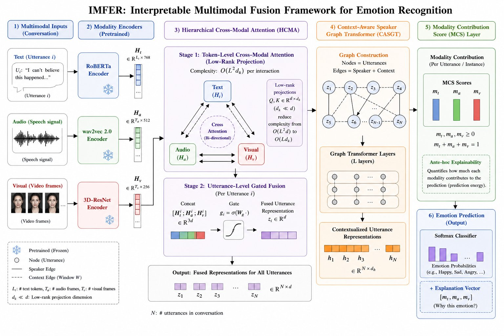

# IMFER: An Interpretable Multimodal Fusion Framework for Emotion Recognition in Conversational AI

[](https://www.python.org/downloads/)
[](https://pytorch.org/)
[](LICENSE)

## Abstract

Emotion Recognition in Conversations (ERC) is an important capability for building empathetic and socially intelligent conversational AI systems. While recent models achieve competitive performance by exploiting multimodal signals—text, audio, and visual—they remain largely opaque. This interpretability gap hinders deployment in high-stakes domains such as mental health support, medical consultation, and customer service analytics.

We propose **IMFER** (Interpretable Multimodal Fusion for Emotion Recognition), a framework that combines:

- **Hierarchical Cross-Modal Attention (HCMA):** A low-rank projection cross-modal attention mechanism that reduces per-interaction attention complexity from O(L²d) to O(L²dₖ) with dₖ ≪ d, yielding ~92% reduction in attention interaction FLOPs (~48% total model FLOPs reduction).
- **Context-Aware Speaker Graph Transformer (CASGT):** Models inter-speaker and intra-speaker emotional dynamics via graph-structured attention.
- **Modality Contribution Score (MCS):** An ante-hoc, instance-level modality attribution layer that decomposes classifier prediction energy across modalities—unlike post-hoc tools (SHAP, LIME).

Extensive experiments on **IEMOCAP**, **MELD**, and **EmoryNLP** benchmarks demonstrate:

| Dataset | Weighted F1 | Accuracy | Parameters |
|---------|:-----------:|:--------:|:----------:|
| IEMOCAP | 69.87 ± 0.21% | 68.93% | 59.4M |
| MELD | 62.34 ± 0.18% | 63.17% | 59.4M |
| EmoryNLP | 40.21 ± 0.29% | — | 59.4M |

Results improve upon compared baselines (paired t-test, p < 0.01; Cohen's d ≥ 1.8) while reducing parameter count by ~31%.

---

## Authors

- [**Sathalla Suresh**](https://www.linkedin.com/in/sathalla-suresh-b9a58962/)
- [**Pandava Sudharshan Babu**](https://www.linkedin.com/in/sudharshan-babu-iitk/)
- [**Mahesh Ramegowda**](https://www.linkedin.com/in/mahesh-ramegowda-5a171b173/)
- [**Omprakash Gottam**](https://www.linkedin.com/in/omprakash-gottam-612882236/)

---

## Architecture Overview



**Fig. 1:** Overview of the proposed IMFER architecture. The framework processes multimodal conversational inputs (text, audio, and visual) using modality-specific pretrained encoders. These representations are fused through the Hierarchical Cross-Modal Attention (HCMA) module, which performs token-level low-rank cross-modal attention followed by utterance-level gated fusion. The fused features are further refined using a Context-Aware Speaker Graph Transformer (CASGT) that models inter-speaker and contextual dependencies. Finally, the Modality Contribution Score (MCS) layer provides interpretable, instance-level attribution by quantifying the contribution of each modality to the prediction.

| Component | Details |
|-----------|---------|
| **Text Encoder** | RoBERTa-base → Hᵗ ∈ ℝ^(L×768) |
| **Audio Encoder** | Wav2Vec 2.0 → Hᵃ ∈ ℝ^(Tₐ×512) |
| **Visual Encoder** | 3D-ResNet-18 → Hᵛ ∈ ℝ^(Tᵥ×256) |
| **HCMA Stage 1** | 6 pairwise cross-modal attention maps, dₖ=64, ~92% attention FLOP reduction |
| **HCMA Stage 2** | Utterance-level gated fusion → zᵢ ∈ ℝ^512 |
| **CASGT** | Speaker graph (W=10) + 4-layer Transformer (8 heads, d=512) |
| **MCS Layer** | Ante-hoc modality attribution: mᵢ ∈ ℝ³, Σⱼ mᵢⱼ = 1 |

---

## Datasets

| Dataset | Utterances | Classes | Labels | Source |
|---------|:----------:|:-------:|--------|--------|
| **IEMOCAP** | 5,531 | 6 | happy, sad, neutral, angry, excited, frustrated | [USC SAIL](https://sail.usc.edu/iemocap/) |
| **MELD** | 13,708 | 7 | neutral, surprise, fear, sadness, joy, disgust, anger | [declare-lab/MELD](https://github.com/declare-lab/MELD) |
| **EmoryNLP** | 12,606 | 7 | joyful, peaceful, powerful, scared, mad, sad, neutral | [emorynlp/emotion-detection](https://github.com/emorynlp/emotion-detection) |

---

## Environment Requirements

| Component | Specification |
|-----------|--------------|
| Python | 3.11+ |
| PyTorch | 2.2+ |
| Hardware (paper) | Apple M4 Pro, 48GB unified memory |
| Hardware (minimum) | Any CPU; GPU optional |
| Training time | ~72 compute-hours per dataset (M4 Pro) |
| Inference | 14.7 ms/utterance (M4 Pro) |

### Installation

```bash
# Clone the repository
git clone https://github.com/<your-username>/IMFER.git
cd IMFER

# Create virtual environment (recommended)
python -m venv .venv
source .venv/bin/activate  # Linux/Mac
# .venv\Scripts\activate   # Windows

# Install dependencies
pip install -r requirements.txt
```

---

## Repository Structure

```
├── README.md                    # Project documentation
├── LICENSE                      # MIT License
├── requirements.txt             # Python dependencies
├── .gitignore                   # Git ignore rules
├── IMFER_build_pipeline.py      # One-command reproduction script
├── IMFER_step_by_step.ipynb     # Interactive notebook for presentation
├── train.py                     # Model training
├── evaluate.py                  # Aggregate evaluation
├── bootstrap_analysis.py        # Bootstrap confidence intervals
├── visualize_results.py         # Figure generation
├── classification_report_and_plots.py  # Per-class metrics & plots
├── complexity_analysis.py       # FLOPs and parameter analysis
├── dk_sensitivity.py            # Hyperparameter sensitivity study
├── insertion_deletion.py        # Modality ablation experiments
├── robustness.py                # Robustness evaluation
├── reproducibility.py           # Reproducibility utilities
├── data_pipeline.py             # Data loading and preprocessing
├── models.py                    # IMFER model (HCMA + CASGT + MCS)
├── losses.py                    # Loss functions
├── config.py                    # Hyperparameter configuration
├── prepare_datasets.py          # Dataset preparation
├── demo_inference.py            # Inference demonstration
├── tests/                       # Unit tests
│   └── test_data_pipeline.py
├── datasets/                    # Dataset metadata & manifests
│   ├── IEMOCAP/metadata.csv
│   ├── MELD/metadata.csv
│   ├── EmoryNLP/metadata.csv
│   └── manifests/               # Feature extraction manifests
├── artifacts/                   # Evaluation results (aggregate)
│   ├── iemocap/aggregate/
│   ├── meld/aggregate/
│   └── emorynlp/aggregate/
└── figures/                     # Generated visualizations
    ├── imfer_architecture.jpeg
    ├── iemocap/
    ├── meld/
    └── emorynlp/
```

---

## Quick Reproduction

### Option 1: Single Command (Recommended)

```bash
python IMFER_build_pipeline.py
```

This runs the full pipeline end-to-end and generates:
- Console output with formatted results tables
- HTML report at `./artifacts/reproduction_report.html`
- All figures in `./figures/<dataset>/`

### Option 2: Interactive Notebook

Open `IMFER_step_by_step.ipynb` and run all cells sequentially.

---

## Step-by-Step Commands

### 1. Dataset Preparation

```bash
python prepare_datasets.py
```

Validates alignment files (`train_align.pkl`, `valid_align.pkl`, `test_align.pkl`) and generates normalized `metadata.csv` per dataset.

### 2. Training

```bash
# Full reproduction (5 seeds)
python train.py --dataset iemocap --device cpu
python train.py --dataset meld --device cpu
python train.py --dataset emorynlp --device cpu

# Quick demonstration (single seed)
python train.py --dataset iemocap --device cpu --seeds 42 --max_epochs 20 --patience 5
```

### 3. Evaluation

```bash
python evaluate.py --artifacts_root ./artifacts --dataset iemocap --num_classes 6
python evaluate.py --artifacts_root ./artifacts --dataset meld --num_classes 7
python evaluate.py --artifacts_root ./artifacts --dataset emorynlp --num_classes 7
```

### 4. Bootstrap Analysis

```bash
python bootstrap_analysis.py --aggregate_csv ./artifacts/iemocap/aggregate/metrics.csv
```

### 5. Visualization

```bash
python visualize_results.py --aggregate_csv ./artifacts/iemocap/aggregate/metrics.csv --output_dir ./figures/iemocap
```

### 6. Classification Report

```bash
python classification_report_and_plots.py \
  --predictions_csv ./artifacts/iemocap/seed_42/predictions/test_predictions.csv \
  --class_names happy,sad,neutral,angry,excited,frustrated \
  --dataset_name iemocap \
  --output_dir ./figures/iemocap
```

---

## Hyperparameters

| Parameter | Value |
|-----------|-------|
| HCMA projection dimension (dₖ) | 64 |
| CASGT window size (W) | 10 |
| Transformer depth | 4 |
| Attention heads | 8 |
| Hidden dimension (d) | 512 |
| Dropout | 0.3 |
| Learning rate (pretrained) | 2×10⁻⁵ |
| Learning rate (new layers) | 1×10⁻³ |
| Optimizer | AdamW |
| Warmup | 10% linear |
| Batch size | 32 utterances |
| Early stopping patience | 10 (val WF1) |
| Seeds | 42, 123, 256, 512, 1024 |

---

## Artifact Layout

```
artifacts/
  <dataset>/
    seed_<seed>/
      checkpoints/best.pt
      predictions/test_predictions.csv
      logs/train.log
      metrics/test_metrics.json
    aggregate/
      metrics.csv
      summary.json
      evaluation_summary.json
      bootstrap_summary.json
      classification_report.json
      classification_report.txt
```

---

## Citation

If you use this code in your research, please cite:

```bibtex
@article{suresh2026imfer,
  title={IMFER: An Interpretable Multimodal Fusion Framework for Emotion Recognition in Conversational AI via Cross-Modal Attention and Explainability Mechanisms},
  author={Suresh, Sathalla and Babu, Pandava Sudharshan and Ramegowda, Mahesh and Gottam, Omprakash},
  year={2026}
}
```

---

## Notes

### MCS Formulation

`MCSLayer` computes normalized modality energies from per-modality projections for each utterance and is aligned to the modality-energy normalization definition used in the paper. Any residual approximation error comes from interaction terms introduced by gating and contextualization.

### Known Limitations

- Some environments may not have full raw audio/video assets available.
- Official split files can differ by release (`val` vs `dev` naming).
- Certain preprocessing details in the paper may be under-specified.
- Exact metric matching can be limited without author-released checkpoints.

---

## License

This project is licensed under the [MIT License](LICENSE). See the LICENSE file for details.
